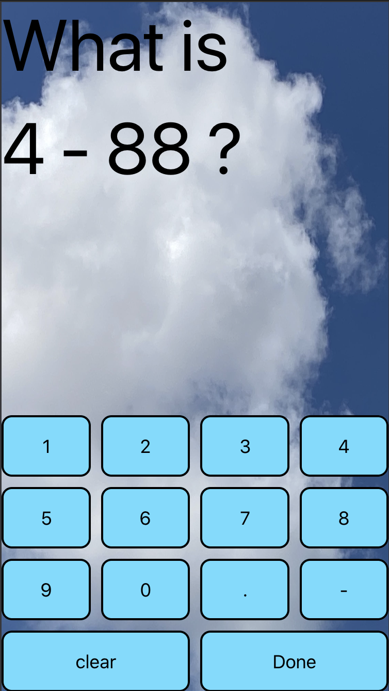

# test my math

## Why
- some people can't do simple math except using calculator, because of that it's takes time to tap on calculator, so it's better to do on our mind to do simple calculate
- by play "test my math" app. user will have chance to do simple math using without calculator which is faster than do tap on calculator

## How
- read the math quotation
- answer it by tap numbers and shown on middle screen as the answer
- tap button "done" and see whether right or wrong, wrong or right will give message and after seconds will random the equotation

## Picture

im using sound from

### zapsplat.net, 
zapslat_multimedia_click
human_group_children_x6_uk_aged_3_to_8_shout_cheer_clap
zapsplat_human_children_x5_under_10_english_cheer_44945
human_audience_comedy_club_komedia_comic_boom_person_cheer_clap_audience_tone_background

### myinstants.com, 
kids_cheering
applause_spIfYBg
human_clapping_8_people
